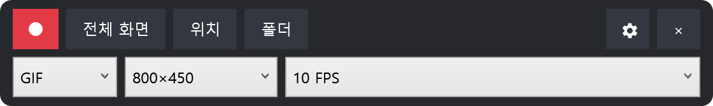

  

<h1 align="center">SimpleCapGIF</h1>

  <a href="README.md">English</a> | 한국어

SimpleCapGIF은 Windows 10/11 x64용 간단한 GIF·Animated WebP 영역 녹화기입니다. 편집기나 업로드 과정 없이 영역을 정하고 녹화와 중단을 누르면 지정한 폴더에 바로 저장합니다.

  

## 시작하기

1. `SimpleCapGIF-v0.2.2-win-x64.zip`을 내려받아 압축을 풉니다. `resources` 폴더는 `SimpleCapGIF.exe` 옆에 그대로 둡니다.
2. `SimpleCapGIF.exe`를 실행합니다. 최초 실행에서는 저장 폴더를 선택하며, 취소하면 앱이 종료됩니다.
3. 검정 테두리 안쪽을 드래그해 영역을 이동하고 8개의 핸들로 크기를 조절합니다.
4. 도구 모음 둘째 줄에서 GIF/WebP, 출력 크기, FPS를 선택합니다.
5. 원형 녹화 아이콘을 누른 뒤 같은 위치의 사각형 중단 아이콘을 누릅니다. 결과는 자동으로 저장됩니다.

## 조작 방법

- **영역 선택:** 검정 테두리 안쪽을 드래그해 이동하고 8개의 핸들로 크기를 조절합니다. **전체 화면**은 활성 모니터 전체를 녹화하며, 영역으로 복귀하면 이전 선택이 복원됩니다. 전체 화면 모드와 녹화 중에는 테두리가 마우스 입력을 통과시켜 아래의 녹화 대상 앱을 조작할 수 있습니다.
- **출력 설정:** GIF/WebP, 출력 크기, FPS를 선택합니다.
- **해상도 프리셋:** 선택 영역을 표시된 물리 픽셀 크기로 맞춥니다. 직접 크기를 바꾸면 **원본**으로 전환되고, 이동만 하면 프리셋이 유지됩니다.
- **녹화 및 저장:** 원형 버튼이나 설정된 전역 단축키(기본값 **Alt+F9**)로 시작합니다. 사각형 버튼이나 같은 단축키를 다시 누르면 중단하고 자동 저장합니다.
- **녹화 성능:** 선택한 FPS의 90% 미만으로 지속되면 도구 모음에 실측/요청 FPS가 표시됩니다. 저장 결과는 실제 녹화 시간을 유지하며, 처리량이 지나치게 지연되면 녹화가 중단될 수 있습니다.
- **저장하지 않고 취소:** **Ctrl+Shift+F12**, 중단 버튼 우클릭 또는 SimpleCapGIF에 포커스가 있을 때 **Esc**를 사용합니다.
- **녹화 설정:** 톱니바퀴 메뉴에서 커서, 시작 지연, 전역 단축키와 3/5/10/15/30초 자동 종료 및 저장을 설정합니다. 기본값은 수동입니다.
- **파일:** **위치**는 저장 폴더를 변경하고 **폴더**는 현재 폴더를 엽니다. 저장 완료 문구를 5초 안에 누르면 결과 파일을 바로 열며, WebP는 Microsoft Edge로 실행됩니다.

## 지원 언어

앱을 시작할 때 Windows UI 언어를 따릅니다. 영어, 한국어, 일본어, 중국어 간체·번체, 포르투갈어(브라질), 스페인어, 독일어, 프랑스어를 지원하며 그 밖의 언어는 영어로 표시됩니다.

## 저장 위치와 개인정보

- 설정: `%LocalAppData%\SimpleCapGIF\settings.json`
- 녹화 임시 파일: `%LocalAppData%\SimpleCapGIF\Temp\{session-id}`
- 저장 위치가 없으면 최초 폴더 선택 창은 `%USERPROFILE%\Pictures\SimpleCapGIF`에서 시작합니다.
- 화면 픽셀이나 사용자 파일 내용은 로그에 기록하지 않습니다.

## 제한 사항

- 녹화 영역은 한 모니터 안에 완전히 들어가야 합니다.
- 오디오, 웹캠, 창 추적, 편집, MP4 내보내기는 제공하지 않습니다.
- HDR을 켠 화면도 녹화할 수 있습니다. 밝은 부분이 하얗게 날아가거나 색이 바래 보이지 않도록 GIF와 WebP에 알맞은 밝기로 자동 조정합니다. 저장된 파일은 일반 화면용(SDR)입니다.
- DRM 등 보호된 콘텐츠는 검게 녹화될 수 있습니다.

## 라이선스와 개발

SimpleCapGIF은 [MIT License](LICENSE)로 배포됩니다. FFmpeg와 다른 포함 구성 요소의 조건은 [THIRD_PARTY_NOTICES.md](THIRD_PARTY_NOTICES.md)를 확인하세요.

빌드, 테스트, 패키징, 아키텍처, 번역 기여 방법은 영문 [DEVELOPMENT.md](DEVELOPMENT.md)를 확인하세요.
