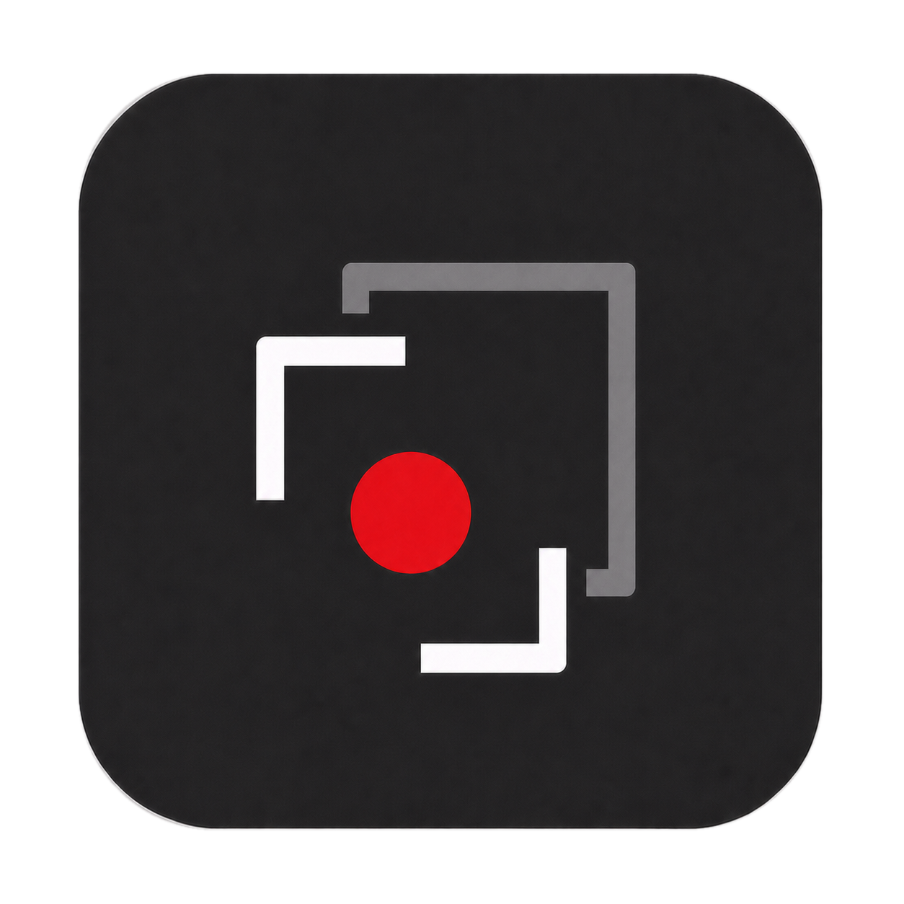
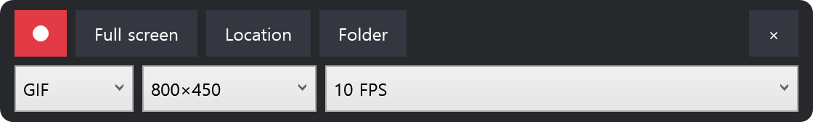

  

<h1 align="center">SimpleCapGIF</h1>

  English | <a href="README.ko-KR.md">한국어</a>

SimpleCapGIF is a minimal region recorder for GIF and Animated WebP on Windows 10/11 x64. Select an area, press Record, then Stop; the result is saved directly to your chosen folder without an editor or upload step.

  

## Get started

1. Download and extract `SimpleCapGIF-v0.1.0-win-x64.zip`.
2. Run `SimpleCapGIF.exe`. On first launch, choose a save folder. Canceling closes the app.
3. Drag inside the black border to move the region, or use the eight handles to resize it.
4. Choose GIF/WebP, output size, and FPS from the second toolbar row.
5. Press the circular Record icon, then the square Stop icon in the same position. The animation is saved automatically.

## Controls

- **Full screen** captures the active monitor. Returning restores the previous region and preset.
- **Location** changes the save folder. **Folder** opens the current save folder.
- Choosing a resolution preset resizes the region to that exact physical-pixel size. Manual resizing switches the preset to **Original**; moving the region keeps the preset.
- The default is GIF at `800×450 · 10 FPS`. WebP defaults to 15 FPS unless you selected an FPS manually.
- The estimated output size turns red at 30 MB. SimpleCapGIF warns instead of silently lowering quality.
- Use the toolbar **×** or the taskbar close command to exit. Active FFmpeg work and temporary files are cleaned up first.

## Languages

The app follows the Windows UI language when it starts. It supports English, Korean, Japanese, Simplified Chinese, Traditional Chinese, Brazilian Portuguese, Spanish, German, and French. Unsupported languages fall back to English.

## Storage and privacy

- Settings: `%LocalAppData%\SimpleCapGIF\settings.json`
- Temporary recording data: `%LocalAppData%\SimpleCapGIF\Temp\{session-id}`
- The initial folder picker opens at `%USERPROFILE%\Pictures\SimpleCapGIF` when no saved location exists.
- SimpleCapGIF makes no network requests and has no account, telemetry, upload, or automatic-update feature.
- Screen pixels and user-file contents are not written to logs.

## Limitations

- A capture region must fit entirely within one monitor.
- Audio, webcam capture, window tracking, editing, and MP4 export are not included.
- HDR tone mapping is not supported in v0.1.0, so HDR colors or brightness may differ.
- DRM-protected content may appear black.
- Video, noise, or other content that changes every frame can exceed 30 MB.

## License and development

SimpleCapGIF is released under the [MIT License](LICENSE). See [THIRD_PARTY_NOTICES.md](THIRD_PARTY_NOTICES.md) for FFmpeg and other bundled components.

For building, testing, packaging, architecture, and localization contributions, see [DEVELOPMENT.md](DEVELOPMENT.md).
